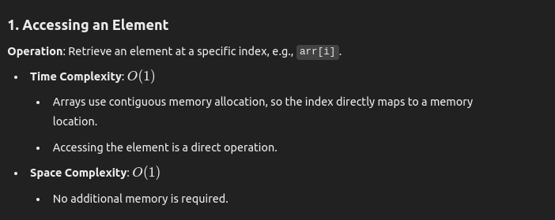
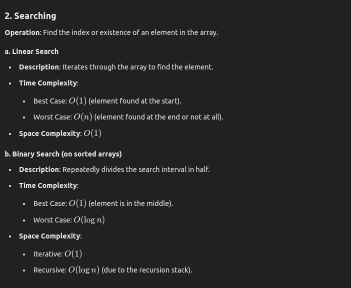
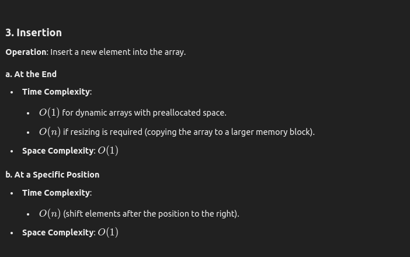
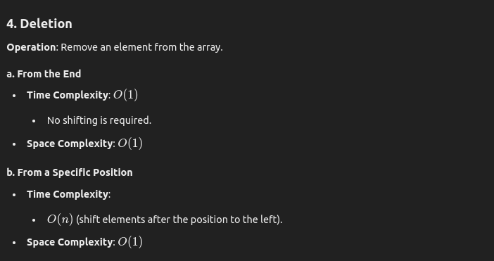
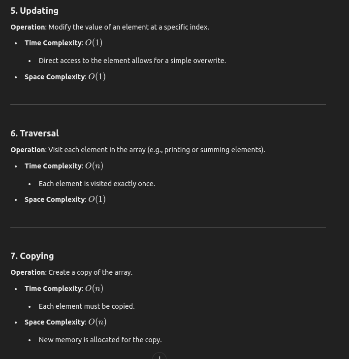
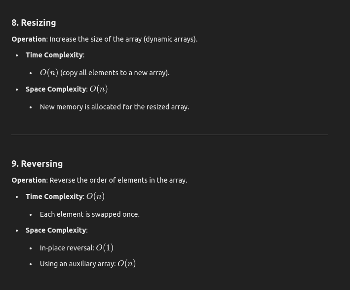
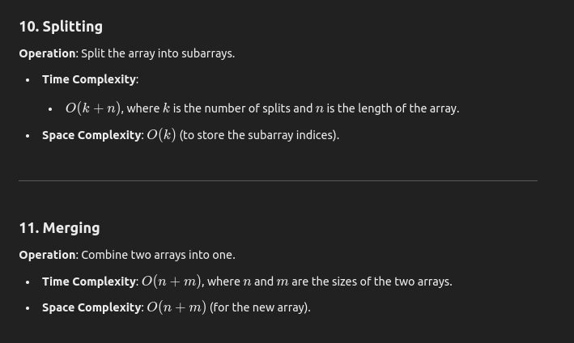
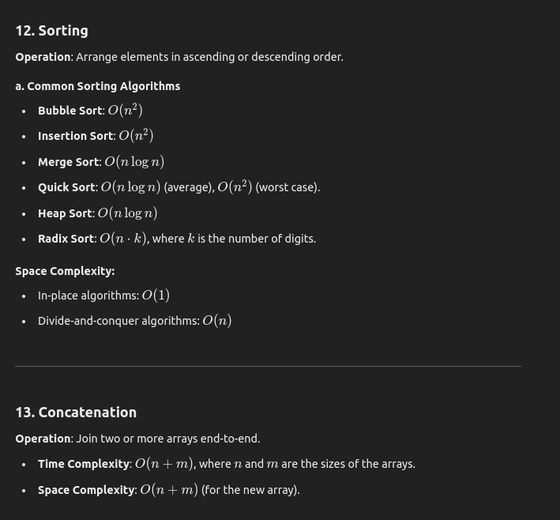
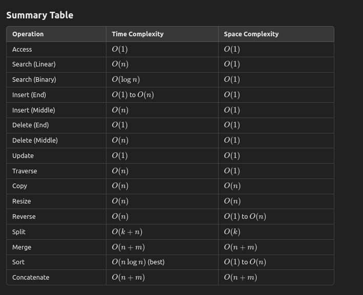

## Complexity of Array Operations
Analyzing the complexity of array operations provides insight into the efficiency of various tasks performed on arrays. Below is a comprehensive breakdown of the common array operations and their complexities.

   

   

   

   

   

   

   

   

   

